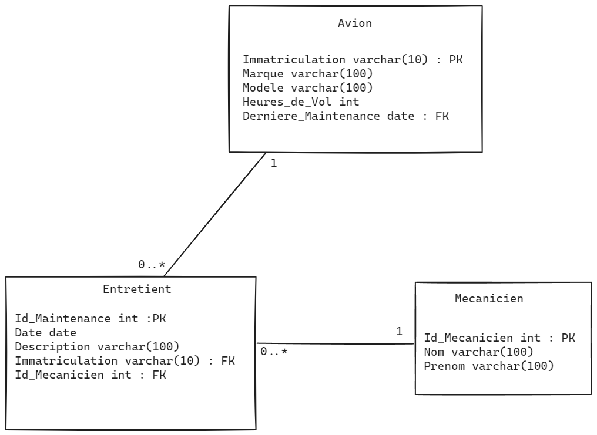
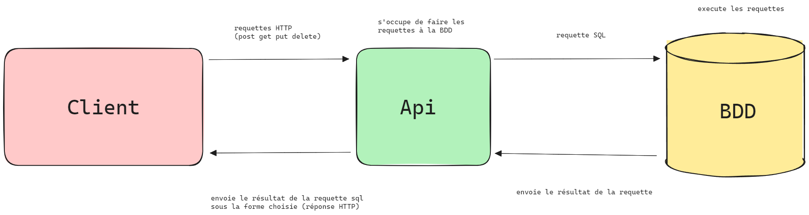

# Api_Gestion_Entretien_Avions

## Description
Ce TP vise à commencer la création d'une API en utilisant une architecture modèle-manager-controller et un package 
externe.

## Modèle conceptuel de données

## Endpoints

| Méthode HTTP | Endpoint                       | Description                                           |
|--------------|--------------------------------|-------------------------------------------------------|
| GET          | /avions                        | Récupère la liste de tous les avions.                 |
| GET          | /avions/{id}                   | Récupère les détails d'un avion spécifique.           |
| GET          | /avions/rechercher?params      | Récupère les avions avec une recherche par détail     |
| POST         | /avions                        | Crée un nouvel avion.                                 |
| PUT          | /avions/{id}                   | Met à jour les détails d'un avion existant.           |
| DELETE       | /avions/{id}                   | Supprime un avion spécifique.                         |
| GET          | /entretiens                    | Récupère la liste de tous les entretiens.             |
| GET          | /entretiens/{id}               | Récupère les détails d'un entretien spécifique.       |
| GET          | /entretiens/rechercher?params  | Récupère les entretiens avec une recherche par détail |
| POST         | /entretiens                    | Crée un nouvel entretien.                             |
| PUT          | /entretiens/{id}               | Met à jour les détails d'un entretien existant.       |
| DELETE       | /entretiens/{id}               | Supprime un entretien spécifique.                     |
| GET          | /mecaniciens                   | Récupère la liste de tous les mécaniciens.            |
| GET          | /mecaniciens/{id}              | Récupère les détails d'un mécanicien spécifique.      |
| GET          | /mecaniciens/rechercher?params | Récupère les mecaniciens avec une recherche par détail |
| POST         | /mecaniciens                   | Crée un nouveau mécanicien.                           |
| PUT          | /mecaniciens/{id}              | Met à jour les détails d'un mécanicien existant.      |
| DELETE       | /mecaniciens/{id}              | Supprime un mécanicien spécifique.                    |

Attention pour les méthdes POST et PUT, il faut envoyer les données en JSON et faire attention a la case (sinon erreur toString).

## Erreurs possibles

## Liste des erreurs possibles

| Endpoint | Erreur | Description |
| --- | --- | --- |
| POST /avions | AVION NON AJOUTE | Les données nécessaires pourraient manquer. L'avion n'a pas été ajouté. |
| GET /avions | AVION NON TROUVE | Aucun avion n'a été trouvé. |
| GET /avions/:immatriculation | AVION NON TROUVE - IMMATRICULATION : {immatriculation} | L'avion avec l'immatriculation spécifiée n'a pas été trouvé. |
| PUT /avions/:immatriculation | AVION NON MODIFIE | L'immatriculation pourrait ne pas exister. L'avion n'a pas été mis à jour. |
| DELETE /avions/:immatriculation | AVION NON SUPPRIME | L'avion avec l'immatriculation spécifiée n'a pas été supprimé. |
| POST /mecaniciens | MECANICIEN NON AJOUTE | Les données nécessaires pourraient manquer. Le mécanicien n'a pas été ajouté. |
| GET /mecaniciens | MECANICIEN NON TROUVE | Aucun mécanicien n'a été trouvé. |
| GET /mecaniciens/:id | MECANICIEN NON TROUVE - ID : {id} | Le mécanicien avec l'ID spécifié n'a pas été trouvé. |
| PUT /mecaniciens/:id | MECANICIEN NON MODIFIE | L'ID pourrait ne pas exister. Le mécanicien n'a pas été mis à jour. |
| DELETE /mecaniciens/:id | MECANICIEN NON SUPPRIME | Le mécanicien avec l'ID spécifié n'a pas été supprimé. |
| POST /entretiens | ENTRETIEN NON AJOUTE | Les données nécessaires pourraient manquer. L'entretien n'a pas été ajouté. |
| GET /entretiens | ENTRETIEN NON TROUVE | Aucun entretien n'a été trouvé. |
| GET /entretiens/:id | ENTRETIEN NON TROUVE - ID : {id} | L'entretien avec l'ID spécifié n'a pas été trouvé. |
| PUT /entretiens/:id | ENTRETIEN NON MODIFIE | L'ID pourrait ne pas exister. L'entretien n'a pas été mis à jour. |
| DELETE /entretiens/:id | ENTRETIEN NON SUPPRIME | L'entretien avec l'ID spécifié n'a pas été supprimé. |

## Creation de la base de données

Voir dans le fichier : [creation-bdd.sql](creation-bdd.sql)

## Schéma du chemin de la requête

## Répo Git

https://github.com/HELIK0PTER/Api_Gestion_Entretien_Avions